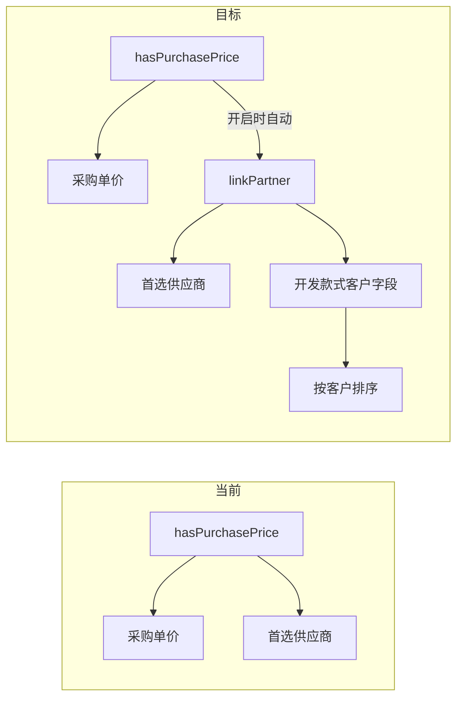

# 产品分类：采购价 / 关联合作单位 双开关

## 现状

- 设置页 `[views/settings/CategoriesTab.tsx](views/settings/CategoriesTab.tsx)` 中单一开关 `hasPurchasePrice`（文案「启用采购价和供应商」）。
- `[components/product/ProductCategoryInfoFields.tsx](components/product/ProductCategoryInfoFields.tsx)` 在 `hasPurchasePrice` 为 true 时同时渲染「参考采购单价」与「首选供应商」。
- 开发管理侧边栏 `[views/development/DevStyleSidebar.tsx](views/development/DevStyleSidebar.tsx)` 已实现 `sortMode === 'customer'`，按 `DevStyleDto.customerName` 分组排序；DB/API 已有 `customer_name` 字段，但**前端无录入 UI**（`[utils/productInfoDevStyleBridge.ts](utils/productInfoDevStyleBridge.ts)` 也未桥接 `customerName`）。




## 数据层

**Prisma** `[backend/prisma/schema.prisma](backend/prisma/schema.prisma)` — `ProductCategory` 新增：

```prisma
linkPartner Boolean @default(false) @map("link_partner")
```

**Migration**（新文件 `backend/prisma/migrations/.../migration.sql`）：

```sql
ALTER TABLE product_categories ADD COLUMN link_partner BOOLEAN NOT NULL DEFAULT false;
UPDATE product_categories SET link_partner = true WHERE has_purchase_price = true;
```

保证原「启用采购价和供应商」的分类升级后两个开关均为开启。

**类型** — `[types.ts](types.ts)` 的 `ProductCategory` 增加 `linkPartner?: boolean`（与 `FinanceCategory.linkPartner` 命名一致）。

## 后端业务规则

`[backend/src/services/settings.service.ts](backend/src/services/settings.service.ts)` 的 `updateCategory` / `createCategory` 增加联动（与前端颜色/批次互斥同级）：


| 操作                                                | 行为                         |
| ------------------------------------------------- | -------------------------- |
| 开启 `hasPurchasePrice`                             | 强制 `linkPartner = true`    |
| 关闭 `linkPartner` 且当前/即将 `hasPurchasePrice = true` | 抛 `400`：「已启用采购价时需保持关联合作单位」 |
| 仅开启 `linkPartner`                                 | 允许（不影响 `hasPurchasePrice`） |


可选：在 `[backend/src/utils/categoryMutex.ts](backend/src/utils/categoryMutex.ts)` 抽 `assertCategoryPurchasePartnerRule()` 便于单测。

**行业预设** `[backend/src/lib/tenantIndustryPresets.ts](backend/src/lib/tenantIndustryPresets.ts)`：`hasPurchasePrice: true` 的原料分类同时写 `linkPartner: true`。

## 设置页 UI

`[views/settings/CategoriesTab.tsx](views/settings/CategoriesTab.tsx)`：

- 将原 toggle 拆为两项：
  - **启用采购价** — `hasPurchasePrice`
  - **关联合作单位** — `linkPartner`（图标 `Building2`，描述参考财务分类）
- `updateCategoryConfig` 内处理联动：
  - 开采购价 → `{ hasPurchasePrice: true, linkPartner: true }`
  - 关关联合作单位 → 若 `cat.hasPurchasePrice` 则 toast 警告并 return（用户已确认采用**禁止关闭**策略）
- 新建分类默认 `linkPartner: false`

## 产品档案 / 开发款式字段

`[components/product/ProductCategoryInfoFields.tsx](components/product/ProductCategoryInfoFields.tsx)`：

- 价格区布局调整：
  - `hasSalesPrice` → 销售单价（不变）
  - `hasPurchasePrice` → **仅**参考采购单价
  - `linkPartner` → **仅**首选供应商（`SupplierSelect`，从 `hasPurchasePrice` 块中拆出）
- 三者可独立出现（例如仅 `linkPartner` 时只显示供应商）

**开发管理客户录入** — `[views/development/DevStyleProductFields.tsx](views/development/DevStyleProductFields.tsx)`：

- 当所选分类 `linkPartner === true` 时，在 `ProductCategoryInfoFields` 上方或下方增加「客户（合作单位）」：
  - 使用现有 `[components/CustomerSelect.tsx](components/CustomerSelect.tsx)`（与计划单一致，存 partner **名称**）
  - 直接绑定 `working.customerName` / `setWorking`
- 不在 `productInfoDevStyleBridge` 中映射 `customerName`（产品档案无此字段，避免污染）

## 开发管理「按客户」排序联动

`[views/development/DevStyleSidebar.tsx](views/development/DevStyleSidebar.tsx)` + `[views/development/DevManagementView.tsx](views/development/DevManagementView.tsx)`：

- 向 Sidebar 传入 `categories: ProductCategory[]`
- 仅当 `categories.some(c => c.linkPartner)` 时展示「按客户」排序按钮；否则隐藏或置灰并 tooltip「请先在设置中为产品分类启用关联合作单位」
- 若用户已选 `customer` 排序但随后所有分类均关闭 `linkPartner`，重置为 `time`（`useEffect` 在父级或 Sidebar 内）

列表卡片 / 主内容区已有 `customerName` 展示（`[DevStyleMainContent.tsx](views/development/DevStyleMainContent.tsx)`），无需改。

## 文档与测试

- `[docs/01-business-rules.md](docs/01-business-rules.md)` §6：补充 `linkPartner` 语义、采购价→关联合作单位联动、开发管理客户字段与按客户排序前置条件
- `[docs/02-data-structures.md](docs/02-data-structures.md)`：`ProductCategory.linkPartner` 字段说明
- 单测：`[backend/tests/categoryMutex.test.ts](backend/tests/categoryMutex.test.ts)` 或新建 `categoryPurchasePartner.test.ts` 覆盖联动规则
- 更新含 mock `ProductCategory` 的测试 fixture（`hasPurchasePrice: false` 处按需补 `linkPartner`）

## 不在本次范围

- 产品 Excel 导入暂不增加供应商列（当前导入模板也无供应商列）
- 不新增 `customerPartnerId`（沿用 `customerName` 字符串，与计划单 customer 字段一致）
- `shared/types.ts` 无需改（`ProductCategory` 仍在根 `types.ts`）

## 实施顺序

1. Migration + schema + `types.ts`
2. Backend `settings.service` 联动 + preset
3. `CategoriesTab` 双开关
4. `ProductCategoryInfoFields` 字段拆分
5. `DevStyleProductFields` 客户录入 + Sidebar 排序门控
6. 文档 + 测试

